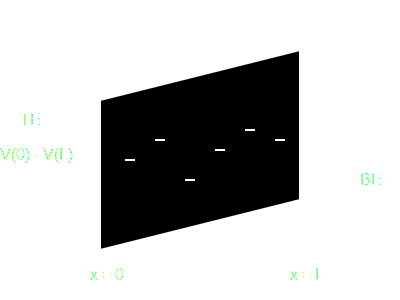

## Document the design process as you go. Please don't wait till you finish writing the code to write documentation.

# Linear Algebra Library
Refer to [this](linear-algebra.md) file for docs on linalg lib.

# Poisson Solver

In this project, the charges were fixed, and discrete. So the potential due to charges essentially becomes the superposition of potentials due to multiple charges. There are functions to return the potential at all grid points given an input of $f_n$ and $d_n$, the probabilities and location of the $n^{th}$ trap. There are also functions to return the potential at a particular location $x$.
The details of all the functions are present [here](poisson/poisson.md)

### What should you use?

The function you should interact with is  
> `Vec getGridE(Vec f_n, Vec d, OxParams params)`

This function returns the energies $E_n$ of the traps, if the inputs are valid. Returns a NULL vector if not valid.

#### Usage

```C
    // Whatever you were doing before

    // Call getGridE to calculate trap energies
    Vec E_n = getGridE(f_n, d_n, params);

    // Check if the function returned a valid result
    if (E_n.x == NULL) {
        printf("Error: Failed to calculate trap energies.\n");
        printf("Possible causes:\n");
        printf("- Input vectors have different lengths\n");
        printf("- Input vectors are empty\n");
        printf("- Invalid values in input vectors\n");
        return;
    }

    // Print the results - only if you want 
    printf("Trap energies calculated successfully.\n");
    printf("Number of traps: %zu\n", E_n.len);
    printf("Energies: ");
    printVecUnits(E_n, 'E'); // E for eV 

    //Whatever you're doing afterwards
    freeVec(&E_n);

```
The input vector $d_n$ and $f_n$ should be corresponding to values from 0 to $L$, as shown below.
The band diagram looks like 

